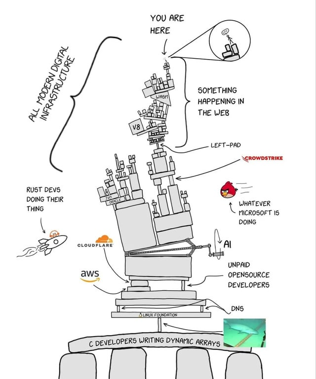

# Full-Stack-Project
A Full Stack Developer is someone who can work on both the front-end and the back-end of an application. They write code and, most of the time, also take care of everything required to push the product into production.

<h3>Modern Digital Infrastructure</h3>

Image source: Internet

